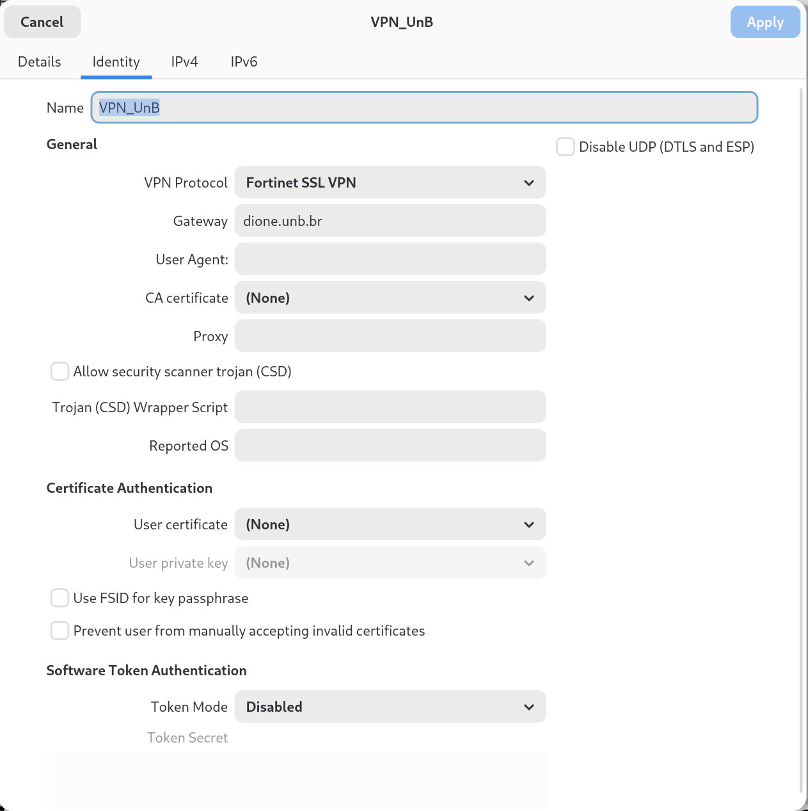

# 🌐 Tutorial: Configurando a VPN da UnB no Debian (via OpenConnect)

## Visão geral
Este guia mostra como conectar-se à VPN institucional da **Universidade de Brasília (UnB)** utilizando o **OpenConnect** com integração ao **NetworkManager / GNOME**, usando o protocolo Fortinet SSL VPN.

---

## 1. Instalar os pacotes necessários

No terminal:

```bash
sudo apt update
sudo apt install openconnect network-manager-openconnect network-manager-openconnect-gnome
```

> `openconnect` = cliente CLI  
> `network-manager-openconnect` + `-gnome` = integração com NetworkManager / GNOME

---

## 2. Criar a conexão no GNOME

1. Abra **Configurações → Rede → VPN → + (Adicionar nova VPN)**.  
2. Escolha **Fortinet SSL VPN** na lista de protocolos.

---

## 3. Preencher os campos (valores recomendados)

### Seção *General*
- **Name:** `VPN_UnB` (ou outro nome de sua escolha)  
- **VPN Protocol:** `Fortinet SSL VPN`  
- **Gateway:** `dione.unb.br`  
- **User Agent:** (deixe em branco)  
- **CA certificate:** (None) — deixar vazio, a validação é feita automaticamente  
- **Proxy:** (deixe em branco, salvo necessidade)  
- **Disable UDP (DTLS and ESP):** desmarcado (marque só se houver problema de estabilidade)  
- **Allow security scanner trojan (CSD):** desmarcado

### Certificate Authentication
- **User certificate:** (None) — normalmente não usado  
- **User private key:** (None)  

### Software Token Authentication
- **Token Mode:** `Disabled` (use apenas se você tiver token específico)

---

## 4. Conectar e autenticar

Ao conectar, o cliente pedirá:
- **Username:** seu usuário institucional (CPF)  
- **Password:** sua senha institucional (mesma do email)

---

## 5. Screenshot da configuração no GNOME

Exemplo de configuração no GNOME NetworkManager:




## 5. Teste via linha de comando (opcional)

Para testar sem a interface gráfica:

```bash
openconnect --protocol=fortinet dione.unb.br -u SEU_USUARIO
```

Digite a senha quando solicitado. Para encerrar: `Ctrl+C`.

---

## 6. Verificar se a VPN está ativa

No terminal, verifique interfaces/túnel:

```bash
ip a | grep tun
# ou
ip a | grep ppp
```

Verifique IP público:

```bash
curl ifconfig.me
```

O IP retornado deve corresponder à faixa da instituição quando o túnel estiver ativo.

---

## 7. Solução de problemas rápida

- **Login failed:** confirme usuário e senha (verifique se não há espaços ou caracteres extras).  
- **Conexão cai:** tente marcar *Disable UDP (DTLS and ESP)* e reconectar.  
- **Erro de certificado:** aceite o certificado na primeira conexão (ou importe o CA se sua instituição fornecer).  
- **Sem tráfego pela VPN:** verifique regras de firewall local e rotas adicionadas pelo NetworkManager.

---

## 8. Notas de segurança e boas práticas

- Não compartilhe usuário/senha publicamente.  
- Prefira repositórios privados se for guardar scripts que contenham credenciais.  
- Para automações, use arquivos de configuração com permissões restritas (`chmod 600`) e variáveis de ambiente — nunca comande credenciais em texto plano num repo público.

---

## 9. Referências
- OpenConnect: https://www.infradead.org/openconnect/  
- NetworkManager OpenConnect plugin: https://wiki.gnome.org/Projects/NetworkManager/VPN
```

Verifique IP público:

```bash
curl ifconfig.me
```

O IP retornado deve corresponder à faixa da instituição quando o túnel estiver ativo.

---

## 7. Solução de problemas rápida

- **Login failed:** confirme usuário e senha (verifique se não há espaços ou caracteres extras).  
- **Conexão cai:** tente marcar *Disable UDP (DTLS and ESP)* e reconectar.  
- **Erro de certificado:** aceite o certificado na primeira conexão (ou importe o CA se sua instituição fornecer).  
- **Sem tráfego pela VPN:** verifique regras de firewall local e rotas adicionadas pelo NetworkManager.

---

## 8. Notas de segurança e boas práticas

- Não compartilhe usuário/senha publicamente.  
- Prefira repositórios privados se for guardar scripts que contenham credenciais.  
- Para automações, use arquivos de configuração com permissões restritas (`chmod 600`) e variáveis de ambiente — nunca comande credenciais em texto plano num repo público.

---

## 9. Referências
- OpenConnect: https://www.infradead.org/openconnect/  
- NetworkManager OpenConnect plugin: https://wiki.gnome.org/Projects/NetworkManager/VPN
